# Teaching AI to Work Your Way: Building Instruction Files for Multi-Agent Development

## Overview

If you use more than one AI coding assistant, you've probably noticed they each have their own personality. Claude Code is thorough but verbose. GitHub Copilot is fast but makes assumptions. They all start from zero every time you open a new session — no memory of your preferences, your project's conventions, or the mistakes they made last time.

I solved this by building a system of instruction files that teach every AI assistant my project's rules, my writing preferences, and the technical gotchas they need to avoid. Now when I open any AI tool in my project, it already knows how I work.

!!! success "The Transformation"
    **BEFORE:** Every new AI session starts from scratch. Repeat yourself constantly. Fix the same mistakes over and over.

    **AFTER:** AI assistants read your instruction files automatically. Your preferences, conventions, and hard-won lessons are preserved across every session and every tool.

---

## Project Details

| Detail | Information |
|--------|-------------|
| **Difficulty** | Intermediate |
| **Time Required** | 1-2 hours |
| **Category** | AI & Machine Learning |
| **Last Updated** | February 2026 |

**Key Technologies:** Claude Code (CLAUDE.md), GitHub Copilot (.github/copilot-instructions.md), MkDocs, Markdown

---

## What You'll Learn

- How different AI tools discover and read instruction files
- How to structure instruction files that actually change AI behavior
- How to capture lessons learned so mistakes don't repeat
- A practical system for keeping multiple AI assistants aligned on the same standards
- How to build these instructions iteratively from real project experience

---

## The Problem: AI Amnesia

Here's the scenario that drove me to build this: I'm working on my documentation site ([codeandcamera.me](https://codeandcamera.me/)) and I ask an AI assistant to create a new post with Mermaid diagrams. The AI:

1. Hardcodes dark background colors into every diagram — looks great in dark mode, completely unreadable in light mode
2. Uses `\n` for line breaks in Mermaid node labels — renders as literal backslash-n text instead of actual line breaks
3. Writes the post in a tone that doesn't match my site
4. Forgets to update the navigation in `mkdocs.yml`
5. Sets `published: true` and deploys a draft to production

I fix all of this. Next session, different AI tool — same mistakes. Every. Single. Time.

The problem isn't that the AI is bad. The problem is that it has no context about my project's specific requirements, my preferences, or the lessons we've already learned together.

```mermaid
flowchart LR
    subgraph without["⛔ Without Instructions"]
        direction TB
        W1["New AI session"] --> W2["No project context"]
        W2 --> W3["Makes assumptions"]
        W3 --> W4["Repeats known mistakes"]
        W4 --> W5["You fix and explain again"]
        W5 --> W1
    end

    subgraph with["✅ With Instructions"]
        direction TB
        I1["New AI session"] --> I2["Reads instruction files"]
        I2 --> I3["Knows your preferences"]
        I3 --> I4["Follows conventions"]
        I4 --> I5["Gets it right the first time"]
    end

    without ~~~ with
```



---

## How AI Tools Read Instructions

Different AI tools look for instruction files in different places. The good news: they all use simple markdown files that live in your repo.

```mermaid
flowchart TB
    subgraph repo["📁 Your Repository"]
        CLAUDE["CLAUDE.md<br/>(project root)"]
        COPILOT[".github/copilot-instructions.md"]
        AGENTS["AGENTS.md<br/>(project root)"]
    end

    subgraph tools["🤖 AI Tools"]
        CC["Claude Code"]
        CD["Claude Desktop"]
        GC["GitHub Copilot"]
        OC["OpenCode / Other"]
    end

    CC --> CLAUDE
    CD --> CLAUDE
    GC --> COPILOT
    OC --> AGENTS

    CC -.->|"also reads"| AGENTS
    GC -.->|"also reads"| AGENTS
```



| File | Location | Read By | Purpose |
|------|----------|---------|---------|
| `CLAUDE.md` | Project root | Claude Code, Claude Desktop | Comprehensive project guide |
| `.github/copilot-instructions.md` | `.github/` directory | GitHub Copilot | Copilot-specific instructions |
| `AGENTS.md` | Project root | Multiple tools | General-purpose agent instructions |

The key insight: **you don't have to maintain completely separate files for each tool.** Create one comprehensive guide (`CLAUDE.md`), then create a compact version for other tools that points back to the main one.

---

## What Belongs in an Instruction File

Not everything belongs in these files. They need to be **specific enough to change behavior** but not so long that the AI ignores the important parts.

### The Right Content

**Project-specific technical rules** — things the AI can't infer from the code alone:

```markdown
## Mermaid Diagram Rules

### CRITICAL: Do NOT Hardcode Colors
Material for MkDocs automatically themes Mermaid diagrams. 
NEVER add style directives with hardcoded fill/stroke colors.

### CRITICAL: Line Breaks in Node Labels
Use <br/> for line breaks inside node labels, NOT \n.
\n renders as literal text in Mermaid.
```

**Your preferences and voice** — how you want content to read:

```markdown
## Writing Voice
- Conversational but technical
- Honest about challenges — don't make things sound easy
- Before/After framing to demonstrate value
- Practical over theoretical
```

**Hard-won lessons** — mistakes that were painful to debug:

```markdown
## Common Issues
- PowerShell aliases `curl` to `Invoke-WebRequest` — use `curl.exe`
- Claude Code runs in Docker — use `host.docker.internal` not `localhost`
- SSE health checks need `--max-time` because streams never close
```

**Checklists for complex tasks** — so steps don't get skipped:

```markdown
## Creating a New Post (Checklist)
1. Create asset directory
2. Create post file with `published: false`
3. Follow the standard post structure
4. Update navigation in mkdocs.yml
5. Update the section index page
6. Commit and push
```

### The Wrong Content

- ❌ **General programming knowledge** — The AI already knows how to write Python
- ❌ **Obvious conventions** — "Use descriptive variable names" doesn't help
- ❌ **Information in the code** — If it's in `package.json` or `mkdocs.yml`, the AI can read it
- ❌ **Entire file contents** — Link to files instead of copying them into the instructions

---

## Step-by-Step Guide

### Step 1: Start With What You Know

Don't try to write the perfect instruction file from day one. Start with the basics and build from experience.

Create `CLAUDE.md` in your project root:

```markdown title="CLAUDE.md"
# Project Guide for AI Assistants

## Project Overview
[What this project is — 2-3 sentences]

## Technology Stack
[List your key technologies]

## Repository Structure
[Directory tree showing where things live]

## Important Rules
[Start with rules you already know about]
```

This alone will prevent the most common AI mistakes — wrong assumptions about your stack, files created in the wrong directories, missing context about what the project does.

### Step 2: Capture Lessons As They Happen

This is where the real value builds up. Every time an AI assistant makes a mistake that you have to correct, **add it to the instruction file immediately.**

The pattern:

1. AI makes a mistake
2. You fix it and explain why
3. You add the rule to `CLAUDE.md` so it never happens again

Real example from my project:

```markdown title="Added after Mermaid diagrams broke in light mode"
## Mermaid Diagram Rules

### CRITICAL: Do NOT Hardcode Colors
Material for MkDocs automatically themes Mermaid diagrams using 
the site's CSS variables. Diagrams adapt for both dark and light mode.

NEVER add style directives with hardcoded colors:

<!-- BAD -->
style myNode fill:#1a1a2e,stroke:#e94560,color:#eee

<!-- GOOD - let the theme handle it -->
(no style directive needed)
```

```markdown title="Added after \n rendered as literal text"
### CRITICAL: Line Breaks in Node Labels
Use <br/> for line breaks, NOT \n:

<!-- BAD - renders as literal "\n" text -->
A["First line\nSecond line"]

<!-- GOOD - renders as actual line break -->
A["First line<br/>Second line"]
```

Over time, your instruction file becomes a **living knowledge base** of everything an AI needs to know about your project — far more valuable than anything you could write from scratch.

### Step 3: Add Your Preferences

Beyond technical rules, capture *how* you want the AI to work. This is what turns generic AI output into something that feels like yours.

```markdown title="Author preferences section"
## Content Voice

### Core Narrative: AI as a Capability Multiplier
The overarching message: AI doesn't just make you faster — it 
expands what you're capable of building.

When writing about projects involving AI:
- Use the narrative: "I couldn't have built this easily without AI"
- Show specific examples of what AI contributed
- Frame AI as a learning accelerator
- Never position AI as doing all the work

### Post Structure
Every post should serve two audiences:
1. Recruiters/professionals who skim headings and diagrams
2. Builders who want the full step-by-step walkthrough

### Future Post Teasers
- Keep vague but compelling — no commitments or timelines
- End with a question that invites reader engagement
```

### Step 4: Create the Compact Version for Copilot

GitHub Copilot reads `.github/copilot-instructions.md`. Rather than duplicating everything, create a compact version with the critical rules and a pointer to the full guide:

```markdown title=".github/copilot-instructions.md"
# Copilot Instructions

Full instructions in CLAUDE.md at the project root.

## Critical Rules
1. Mermaid diagrams: NEVER hardcode colors. Use <br/> for 
   line breaks, NOT \n.
2. New posts: Always set published: false in frontmatter.
3. Navigation: Update mkdocs.yml AND the section index.md.
4. Assets: Store images in docs/assets/<section>/<post-slug>/
5. Voice: AI as capability multiplier, honest about challenges.
```

### Step 5: Structure for Scannability

AI assistants read these files in full, but they prioritize clearly structured content. Use formatting that makes rules impossible to miss:

- **Bold "CRITICAL" labels** for rules that cause real breakage
- **Code examples** showing BAD vs GOOD patterns (AI learns best from examples)
- **Checklists** for multi-step processes
- **Tables** for reference data (color values, file locations, etc.)
- **Short paragraphs** — walls of text get deprioritized

??? tip "Example: Color Reference Table"
    ```markdown
    | Purpose | Light Mode | Dark Mode | CSS Variable |
    |---------|-----------|-----------|-------------|
    | Primary | #3f51b5 | #3f51b5 | --md-primary-fg-color |
    | Accent | #ffc107 | #ffeb3b | --md-accent-fg-color |
    | Background | #ffffff | #0d1117 | --md-default-bg-color |
    ```

---

## Results: What This Actually Looks Like

With instruction files in place, here's the difference:

### Before Instructions

> **Me:** "Create a new blog post about my MCP infrastructure with Mermaid diagrams."
>
> **AI:** Creates post with hardcoded dark colors in diagrams, uses `\n` for line breaks, sets `published: true`, forgets to update navigation, writes in a generic tutorial voice.
>
> **Me:** *Spends 30 minutes fixing all of it, then explains each issue.*

### After Instructions

> **Me:** "Create a new blog post about my MCP infrastructure with Mermaid diagrams."
>
> **AI:** Creates post with theme-aware diagrams using `<br/>` for line breaks, sets `published: false`, updates `mkdocs.yml` and the section index, writes in the established voice with before/after framing and a compelling future teaser.
>
> **Me:** *Reviews and publishes.*

The instruction file for my documentation site grew from ~80 lines to ~370 lines over the course of a few sessions. Every line was earned by a real mistake or a real preference that needed capturing. That's 370 lines of context that every AI assistant gets for free, in every session, forever.

<!-- TODO: Add screenshot showing CLAUDE.md in project root -->
<!--  -->

---

## Common Issues & Troubleshooting

### AI Ignores Certain Instructions

**Problem:** You added a rule but the AI still makes the mistake.

**Fix:** Make the instruction more prominent. Use `### CRITICAL:` headers, show BAD vs GOOD code examples, and move the most important rules near the top of the file. AI assistants weigh content near the beginning of instruction files more heavily.

### Instruction File Getting Too Long

**Problem:** Your `CLAUDE.md` is 1000+ lines and feels unwieldy.

**Fix:** Keep the instruction file focused on *rules that change behavior*. Move reference documentation (API endpoints, full config files) into separate docs and link to them. The instruction file should be a set of rules and preferences, not a knowledge base.

### Different AI Tools Behave Differently

**Problem:** Claude Code follows your instructions perfectly but Copilot still makes mistakes.

**Fix:** Ensure `.github/copilot-instructions.md` contains the most critical rules directly (not just a pointer to `CLAUDE.md`). Different tools have different instruction file discovery and some may not follow cross-references. Put the rules that cause the most breakage directly in each tool's instruction file.

### Instructions Become Stale

**Problem:** Your project evolved but the instruction file still references old patterns.

**Fix:** Update instructions as part of your workflow. When you refactor code or change conventions, update the instruction files in the same commit. Treat them like documentation — they're only useful if they're current.

---

## What's Next

Instruction files are a starting point. Once you have AI assistants that understand your project, there are interesting directions to explore:

- **Cross-project instruction inheritance** — shared conventions that apply across all your repos, with project-specific overrides
- **Automated instruction generation** — could an AI analyze your commit history and PR feedback to draft instruction rules?
- **Team-scale instruction files** — maintaining shared AI conventions across a team, versioned and reviewed like code
- **Dynamic context injection** — loading different instruction sets based on what part of the codebase you're working in

The tools for configuring AI assistants are evolving fast. What's a manual markdown file today could become a structured configuration system tomorrow. But the core idea will stay the same: **the more context you give your AI tools, the better they work for you.**

!!! question "What Rules Would You Write First?"
    If you were starting an instruction file for your project today, what's the first rule you'd add? What mistake have you corrected the most times? That's where to start.

---

## Resources & References

- [Claude Code CLAUDE.md Documentation](https://docs.anthropic.com/en/docs/claude-code/memory#claudemd) — How Claude Code discovers and reads instruction files
- [GitHub Copilot Custom Instructions](https://docs.github.com/en/copilot/customizing-copilot/adding-repository-custom-instructions-for-github-copilot) — Copilot's instruction file spec
- [MkDocs Material](https://squidfunk.github.io/mkdocs-material/) — The documentation framework used in this post's examples
- [Mermaid Diagram Syntax](https://mermaid.js.org/syntax/flowchart.html) — Reference for the diagram examples


