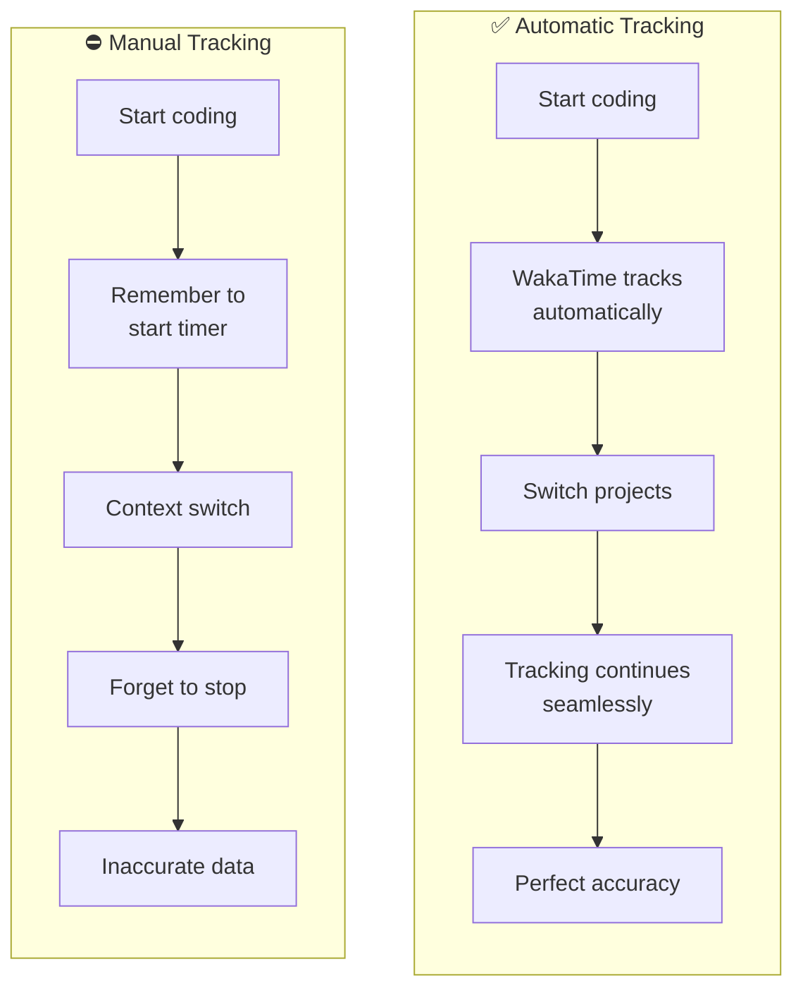

# Automatic Time Tracking with WakaTime and OpenCode

How much time do you actually spend coding each day? Not "at your desk" time — actual keyboard-to-screen time. What languages dominate your workweek? Which projects consume your focus?

I couldn't answer these questions until I added WakaTime to OpenCode. Now every keystroke is tracked automatically. No timers, no manual logging, no forgetting to clock in. Just transparent insight into where my coding time actually goes.

!!! success "The Result"
    **BEFORE:** Vague guesses about time spent coding ("probably 4 hours today?")
    
    **AFTER:** Precise metrics showing language breakdown, project distribution, and actual coding time
    
    **Setup time:** 5 minutes

---

## Project Details

| Detail | Information |
|--------|-------------|
| **Difficulty** | Beginner |
| **Time Required** | 5 minutes |
| **Category** | AI & Productivity |
| **Last Updated** | April 2026 |

**Key Technologies:** WakaTime, OpenCode, automatic time tracking

---

## What You'll Learn

- How to install the WakaTime plugin for OpenCode
- Where to find and configure your WakaTime API key
- What metrics WakaTime tracks automatically
- How to interpret your WakaTime dashboard

---

## The Manual Alternative

Before automatic time tracking, you had two options:

1. **Manual time logging** — Start a timer when you code, stop when you context-switch. Forget constantly. Lose accuracy.
2. **Educated guessing** — "I worked on that Python project for... 3 hours? Maybe 4?"



---

## What WakaTime Tracks

WakaTime runs in the background and captures:

- **Time spent coding** — Actual keyboard activity, not idle time
- **Languages used** — Python, JavaScript, YAML, Markdown, etc.
- **Projects worked on** — Broken down by directory/repository
- **Editors used** — OpenCode, VS Code, Vim, etc.
- **Operating system** — Windows, macOS, Linux
- **Daily patterns** — When you're most productive

All of this happens **completely automatically**. You don't start or stop anything. Just code, and WakaTime records it.

---

## Prerequisites

- OpenCode installed and running
- A WakaTime account (free at [wakatime.com](https://wakatime.com/))
- Your WakaTime API key (found in your WakaTime account settings)

---

## Step-by-Step Setup

### Step 1: Get Your WakaTime API Key

1. Go to [wakatime.com](https://wakatime.com/) and sign up (or log in)
2. Navigate to **Settings** → **API Key**
3. Copy your API key (format: `waka_XXXXXXXX-XXXX-XXXX-XXXX-XXXXXXXXXXXX`)

### Step 2: Install the OpenCode WakaTime Plugin

Open your OpenCode configuration file:

=== "Windows"

    ```plaintext
    C:\Users\<your-username>\.config\opencode\opencode.json
    ```

=== "macOS/Linux"

    ```plaintext
    ~/.config/opencode/opencode.json
    ```

Add the WakaTime plugin to the `plugin` array:

```json title="opencode.json" hl_lines="3"
{
  "plugin": [
    "opencode-wakatime"
  ]
}
```

If you already have plugins listed, just add `"opencode-wakatime"` to the array:

```json
{
  "plugin": [
    "some-other-plugin",
    "opencode-wakatime"
  ]
}
```

### Step 3: Configure Your API Key

Create (or edit) your WakaTime configuration file:

=== "Windows"

    ```plaintext
    C:\Users\<your-username>\.wakatime.cfg
    ```

=== "macOS/Linux"

    ```plaintext
    ~/.wakatime.cfg
    ```

Add your API key:

```ini title=".wakatime.cfg"
[settings]
api_key = waka_XXXXXXXX-XXXX-XXXX-XXXX-XXXXXXXXXXXX
```

Replace `waka_XXXXXXXX-XXXX-XXXX-XXXX-XXXXXXXXXXXX` with your actual API key from Step 1.

### Step 4: Restart OpenCode

Close and reopen OpenCode to activate the WakaTime plugin.

That's it. WakaTime is now tracking your coding activity automatically.

---

## Verifying It Works

After coding for a few minutes in OpenCode:

1. Go to your [WakaTime dashboard](https://wakatime.com/dashboard)
2. You should see recent activity appearing
3. Check the **Languages**, **Projects**, and **Editors** tabs to see the breakdown

<!-- TODO: Add screenshot of WakaTime dashboard -->
<!-- File: docs/assets/ai/wakatime-opencode-setup/wakatime-dashboard.png -->

If nothing appears after 10-15 minutes of active coding, double-check:

- API key is correct in `.wakatime.cfg`
- Plugin is listed in `opencode.json`
- You restarted OpenCode after making the changes

---

## What the Dashboard Shows You

The WakaTime dashboard gives you insights you can't get any other way:

**Daily/Weekly/Monthly Summaries:**
- Total coding time
- Most-used languages
- Most active projects
- Coding hours by day of week

**Project Breakdown:**
- How much time you spent on each codebase
- Language distribution per project

**Productivity Patterns:**
- When you code most (morning vs afternoon vs evening)
- Which days you're most active

**Editor Usage:**
- If you use multiple editors (OpenCode, VS Code, Vim), see the breakdown

This data helps you:
- Understand where your time actually goes
- Identify patterns (e.g., "I'm most productive 9-11 AM")
- Track how much time you spend on personal projects vs work
- Show concrete proof of your coding activity (useful for freelancers or time-based billing)

---

## Privacy & Data

WakaTime tracks:
- ✅ File names, languages, projects, time spent
- ✅ Editor used, operating system

WakaTime **does NOT** track:
- ❌ The actual code you write
- ❌ File contents
- ❌ Keystrokes beyond activity detection

All data is private by default. You control who sees your stats (public profiles are opt-in).

---

## Results

Since installing WakaTime, I've learned:

- I spend ~60% of my time in Python, 25% in YAML (n8n workflows), 15% in Markdown (documentation)
- My most productive hours are 8-10 AM
- I context-switch between projects more than I realized (average 4-5 projects per day)
- My actual coding time is about 4 hours/day, not the 6-8 I thought

This isn't about maximizing every minute. It's about **seeing reality clearly** so you can make better decisions about your time.

<!-- TODO: Add screenshot showing language breakdown -->
<!-- File: docs/assets/ai/wakatime-opencode-setup/language-breakdown.png -->

---

## Troubleshooting

### No Activity Showing Up

**Problem:** Dashboard still empty after 30 minutes of coding

**Fix:**

1. Check that `.wakatime.cfg` exists and has your API key
2. Verify `opencode-wakatime` is in `opencode.json`
3. Restart OpenCode
4. Check WakaTime logs (if available) for errors

### Wrong Projects Being Tracked

**Problem:** WakaTime is grouping files from different projects together

**Fix:** WakaTime detects projects based on `.git` directories and other project files. If you're working in a subdirectory without clear project markers, it might misattribute time. Add a `.wakatime-project` file to the root of your project with the project name:

```plaintext title=".wakatime-project"
my-project-name
```

### OpenCode Doesn't Load Plugin

**Problem:** Plugin listed in `opencode.json` but not loading

**Fix:** Ensure the JSON syntax is valid (no trailing commas, proper quotes). Use a JSON validator if needed.

---

## What's Next

Automatic time tracking opens up possibilities:

- **Billing automation** — Generate invoices based on tracked project time
- **Productivity analytics** — Correlate coding patterns with external factors (sleep, coffee intake, meeting load)
- **Team insights** — Aggregate WakaTime data across a team for project estimation
- **Habit tracking** — Set coding time goals and track progress

I'm exploring how WakaTime data can feed into a personal dashboard that shows not just coding metrics, but how they correlate with other productivity signals. Could you predict your most productive days based on sleep and coding patterns? Maybe.

!!! question "What Would You Track?"
    Beyond time and languages, what coding metrics would you want to see? File churn rate? Refactor vs new code ratio? Error density?

---

## Resources

- [WakaTime Website](https://wakatime.com/)
- [OpenCode WakaTime Plugin](https://github.com/angristan/opencode-wakatime)
- [WakaTime Documentation](https://wakatime.com/help)
- [OpenCode Documentation](https://opencode.ai/docs)

---

**Difficulty**: Beginner | **Time**: 5 minutes
