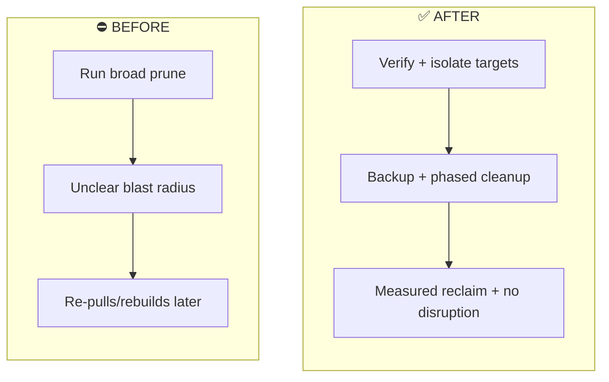

# Docker Desktop Cleanup Reference: Reclaiming Disk Without Breaking Active Workloads

## Overview

After months of normal Docker Desktop usage, image churn and stale build layers had accumulated enough waste to justify a controlled cleanup.

This page documents the exact command sequence, why each command was used, and the before/after results. The goal is simple: reclaim disk and memory while preserving all active workloads.

!!! success "Before -> After"
    **Before:** 79.77 GB images + 14.6 GB build cache + stranded container using ~2.72 GB RAM

    **After:** 18.53 GB images + 11.71 GB build cache + stranded container removed

    **Net reclaim:** ~64 GB disk + ~2.7 GB live RAM, with active workloads preserved

---

## Project Details

| Detail | Information |
|---|---|
| **Difficulty** | Intermediate |
| **Time Required** | 20-30 minutes |
| **Category** | Docker Desktop housekeeping |
| **Last Updated** | May 2026 |

**Environment:** Windows 11, Docker Desktop (Personal), PowerShell 7.5.5

---

## The Manual Workflow (What I Used to Do)

Cleanup used to be ad hoc: run a broad prune command, hope nothing important gets removed, then find out later if rebuilds or missing data caused friction.

This session switched to a controlled workflow: verify -> target -> back up -> prune by scope -> verify again.



---

## Session Inputs (Filled Values)

| Item | Value |
|---|---|
| Stranded container | `funny_perlman` |
| Stranded image | `rancher/rancher:latest` |
| Stranded image keyword | `rancher` |
| Named volume preserved + backed up | `claude-memory` |
| Backup tarball path | `C:\Users\joelo\claude-memory-backup.tar.gz` |
| Backup content verification | `./index.js` (2,928 bytes total) |

### Active workloads preserved

- `ajeetraina_selenium-docker-extension-desktop-extension`
- `proxmox-mcp-sse-1`
- `proxmox-mcp-api-1`

---

## Pre-state vs Post-state

| Area | Before | After | Delta |
|---|---|---|---|
| Images | 114 total / 6 active / 79.77 GB / 63.21 GB reclaimable | 21 / 6 active / 18.53 GB / 5.246 GB reclaimable | -93 images; -61.24 GB used |
| Containers | 6 / 6 active / 33.51 MB | 6 / 6 / 33.51 MB / 0 B reclaimable | Runtime footprint unchanged |
| Local Volumes | 1 / 0 active | 1 / 0 / 16.67 KB | Active volume count unchanged |
| Build Cache | 176 / 0 active / 14.6 GB / 10.19 GB reclaimable | 107 / 0 / 11.71 GB | -69 cache entries; -2.89 GB |

---

## Reclaim Breakdown

| Cleanup phase | Disk reclaimed | RAM freed |
|---|---:|---:|
| Stranded container removal | 2.34 GB | 2.72 GB |
| Dangling volume prune | 3.534 GB | n/a |
| Build cache prune (`>30d`) | 2.888 GB | n/a |
| Bulk `<none>` image removal | ~58 GB (79.77 GB -> 18.53 GB image delta) | n/a |

---

## Command Reference (Full Session)

| # | Command | What it does |
|---|---|---|
| 1 | `docker version` | Verifies CLI and daemon connectivity before destructive operations. |
| 2 | `docker ps --filter "name=<STRANDED_CONTAINER>"` | Confirms the exact target container before stop/remove. |
| 3 | `docker stop <STRANDED_CONTAINER>` | Sends SIGTERM and stops the container gracefully if possible. |
| 4 | `docker rm <STRANDED_CONTAINER>` | Removes the stopped container and its writable layer. |
| 5 | `docker volume ls` | Lists all Docker-managed volumes for triage. |
| 6 | `docker volume ls --filter dangling=true` | Limits view to unattached volumes (safe deletion candidates). |
| 7 | `docker volume inspect <NAMED_VOLUME>` | Pulls volume metadata to decide whether to preserve data. |
| 8 | `docker run --rm -v <NAMED_VOLUME>:/data -v ${PWD}:/backup alpine tar czf /backup/<NAMED_VOLUME>-backup.tar.gz -C /data .` | Creates a backup tarball of the named volume before destructive cleanup. |
| 9 | `ls <NAMED_VOLUME>-backup.tar.gz` | Verifies the backup archive exists on the host filesystem. |
| 10 | `tar -tzf <NAMED_VOLUME>-backup.tar.gz \| Select-Object -First 20` | Verifies archive contents without extraction. |
| 11 | `docker volume prune -f` | Deletes dangling volumes in one pass. |
| 12 | `docker builder prune -af --filter "until=720h"` | Removes stale build cache older than 30 days. |
| 13 | `docker image prune -f` | Removes true dangling `<none>:<none>` images only. |
| 14 | `docker images --format "table {{.Repository}}:{{.Tag}}\t{{.Size}}\t{{.CreatedSince}}" \| Sort-Object` | Produces sorted image inventory to identify stale and duplicate images. |
| 15 | `docker images --format "{{.Repository}}:{{.Tag}} {{.ID}}" \| Select-String ":<none>" \| ForEach-Object { ($_ -split " ")[1] } \| ForEach-Object { docker rmi $_ }` | Removes orphaned `<none>`-tag image IDs safely; in-use image removals are skipped. |
| 16 | `docker rmi <STRANDED_IMAGE>` | Explicitly attempts removal of the stranded container's image. |
| 17 | `docker images \| Select-String <STRANDED_IMAGE_KEYWORD>` | Confirms the stranded image is no longer present. |
| 18 | `docker system df` | Final scoreboard for images, containers, volumes, and build cache. |

---

## Concrete Commands from This Session

```powershell
# Step 2 - confirm target
docker ps --filter "name=funny_perlman"

# Step 3 - stop
docker stop funny_perlman

# Step 4 - remove
docker rm funny_perlman

# Step 7 - inspect named volume
docker volume inspect claude-memory

# Step 8 - backup named volume to host home directory
docker run --rm -v claude-memory:/data -v ${PWD}:/backup alpine tar czf /backup/claude-memory-backup.tar.gz -C /data .

# Step 16 - explicit image removal (may report "No such image" if already swept)
docker rmi rancher/rancher:latest

# Step 17 - sanity check
docker images | Select-String rancher
```

---

## Why This Is Safe To Document

- The commands and metrics describe operational hygiene, not application internals.
- No API keys, tokens, credentials, or private payload data are included.
- The named volume backup path is local host context and preserves recoverability.
- The workflow is verification-first and explicitly avoids blind destructive cleanup.

---

## Anti-patterns to Avoid

- Running `docker system prune -a --volumes` without triage.
- Skipping named-volume backup before volume deletion.
- Running blind `docker image prune -a` in mixed-use environments.
- Using GUI delete actions for volumes without inspect/backup checks.
- Running cleanup while builds are in progress.
