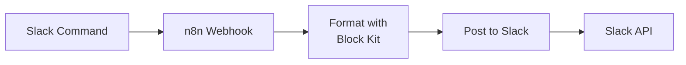

# Upgrading Slack Bot Messages: From Plain Text to Block Kit

My Proxmox Slack bot worked fine but looked ugly. The messages were plain text that looked like terminal dumps. I wanted to upgrade to Slack's Block Kit framework for better formatting.

I converted all six message formatters to Block Kit. Deployed. Tested.

Nothing happened. No error, no message—just silent failure.

This post covers what Block Kit is, how to implement it in n8n, and the debugging issue that almost killed the project.

---

!!! success "Before → After"
    **Before**: Plain text messages<br/>
    **After**: Block Kit with headers, dividers, and multi-column layouts<br/>
    **Bug fixed**: n8n serialization issue (15 minutes with AI help)

---

## What This Covers

- Block Kit basics for Slack bots
- Before/after code comparison
- The n8n serialization bug that broke everything
- How AI helped debug it

---

## Block Kit Basics

Slack's Block Kit is a UI framework for bot messages. Instead of plain text, you build messages from components:

- **Headers**: Large titles
- **Sections**: Text blocks with optional fields (creates columns)
- **Dividers**: Visual separators
- **Context**: Small metadata text

Here's the workflow:



## Before/After Code

**Before (Plain Text)**:

```javascript
// Format Status (Plain Text) - D:\prod-server01\proxmox-slack-bot\old-formatter.js
const data = $input.first().json;

let message = `🖥️ *Proxmox Status*\n\n`;
message += `*Cluster*: ${data.cluster.name}\n`;
message += `*Status*: ${data.cluster.quorate ? '✅ Quorate' : '⚠️ Not Quorate'}\n`;
message += `*Nodes*: ${data.cluster.nodes}\n\n`;

message += `*Node: pve*\n`;
message += `CPU: ${data.node.cpu.toFixed(1)}%\n`;
message += `Memory: ${(data.node.memory.used / 1024 / 1024 / 1024).toFixed(1)}GB / `;
message += `${(data.node.memory.total / 1024 / 1024 / 1024).toFixed(1)}GB\n`;
message += `Uptime: ${Math.floor(data.node.uptime / 86400)}d `;
message += `${Math.floor((data.node.uptime % 86400) / 3600)}h\n`;

return { message };
```

**After (Block Kit)**:

```javascript
// Format Status (Block Kit) - D:\prod-server01\proxmox-slack-bot\format-status.js
const data = $input.first().json;

const blocks = [
  {
    type: "header",
    text: {
      type: "plain_text",
      text: "🖥️ Proxmox Status"
    }
  },
  {
    type: "section",
    fields: [
      {
        type: "mrkdwn",
        text: `*Cluster*\n${data.cluster.name}`
      },
      {
        type: "mrkdwn",
        text: `*Status*\n${data.cluster.quorate ? '✅ Quorate' : '⚠️ Not Quorate'}`
      },
      {
        type: "mrkdwn",
        text: `*Nodes*\n${data.cluster.nodes}`
      }
    ]
  },
  { type: "divider" },
  {
    type: "section",
    text: {
      type: "mrkdwn",
      text: "*Node: pve*"
    }
  },
  {
    type: "section",
    fields: [
      {
        type: "mrkdwn",
        text: `*CPU*\n${data.node.cpu.toFixed(1)}%`
      },
      {
        type: "mrkdwn",
        text: `*Memory*\n${(data.node.memory.used / 1024 / 1024 / 1024).toFixed(1)}GB / ${(data.node.memory.total / 1024 / 1024 / 1024).toFixed(1)}GB`
      },
      {
        type: "mrkdwn",
        text: `*Uptime*\n${Math.floor(data.node.uptime / 86400)}d ${Math.floor((data.node.uptime % 86400) / 3600)}h`
      }
    ]
  },
  {
    type: "context",
    elements: [
      {
        type: "mrkdwn",
        text: `Last updated: <!date^${Math.floor(Date.now() / 1000)}^{date_short_pretty} at {time}|${new Date().toISOString()}>`
      }
    ]
  }
];

return { blocks };
```

**Key differences**:

1. Headers and dividers create visual hierarchy
2. `fields` array creates columns (up to 2 per section)
3. Context block for metadata
4. Slack date formatting renders in user's timezone

## The Bug: Silent Failure

After deploying the Block Kit code, the bot stopped working. No error in n8n, no message in Slack.

Checking the n8n execution logs revealed the actual error:

```json
{
  "ok": false,
  "error": "invalid_blocks_format"
}
```

The workflow showed green because the HTTP request succeeded (200 OK), but Slack rejected the payload.

**The problem**: n8n's "Using Fields Below" mode was stringifying the `blocks` array:

```json
{
  "channel": "C123456",
  "text": "Proxmox status update",
  "blocks": "[object Object],[object Object]"  // ❌ STRING not array
}
```

**The fix**: Switch to "Using JSON" body mode:

1. Open "Post to Slack" node in n8n
2. Change "Send Body" from "Using Fields Below" to "Using JSON"
3. Enter this expression:

```javascript
={{
  {
    channel: $('Parse Command').first().json.channelId,
    text: "Proxmox status update",
    blocks: $json.blocks  // ✅ Array passed correctly
  }
}}
```

That's it. The `blocks` array now passes through as actual JSON instead of being stringified.

## Results

<!-- TODO: Screenshot of old plain text message in Slack -->
<!-- File: before-plain-text.png -->


<!-- TODO: Screenshot of new Block Kit message in Slack -->
<!-- File: after-block-kit.png -->

Commands: `/proxmox status`, `/proxmox vms`, `/proxmox containers`, `/proxmox storage`, `/proxmox backups`, `/proxmox help`

---

## Resources

- [Slack Block Kit Builder](https://app.slack.com/block-kit-builder)
- [Block Kit Reference](https://api.slack.com/block-kit)
- [n8n Expression Guide](https://docs.n8n.io/code-examples/expressions/)
- [Original Proxmox Slack Bot Post](../homelab/proxmox-slack-bot.md)

---

**Difficulty**: Intermediate | **Time**: 2 hours
