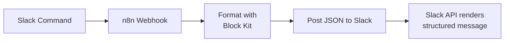

# Upgrading Slack Bot Messages: From Plain Text to Block Kit

This upgrade turned a functional but hard-to-scan Slack bot into a structured status interface that teams can read quickly. The implementation looked straightforward until a serialization issue caused a silent failure.

---

!!! success "Before → After"
    **Before**: Plain text messages<br/>
    **After**: Block Kit with headers, dividers, and multi-column layouts<br/>
    **Bug fixed**: n8n serialization issue (15 minutes with AI help)

---

## Why this matters

Operational bots succeed or fail on readability. If status messages look like terminal dumps, people ignore them. Structured messages reduce scan time and lower support friction when someone needs fast infrastructure context.

## Problem

The bot posted plain text blocks with weak hierarchy. Important values were present, but the format made it harder to parse under time pressure.

After converting formatters to Block Kit, Slack stopped rendering messages entirely because the payload shape was wrong.

## Previous workflow

1. Run a slash command such as `/proxmox status`.
2. Receive plain text output with minimal visual structure.
3. Manually scan lines to find cluster state, node metrics, and uptime.
4. Troubleshoot failures through n8n logs when formatting changes broke output.

## New workflow

1. Slash command triggers n8n webhook.
2. Formatter returns a valid `blocks` array.
3. Slack renders structured Block Kit sections (header, fields, divider, context).
4. Operators scan core metrics faster and act with less ambiguity.


```mermaid
flowchart LR
    A[Slack Command] --> B[n8n Webhook]
    B --> C[Format with<br/>Block Kit]
    C --> D[Post JSON to Slack]
    D --> E[Slack API renders<br/>structured message]
```

## Tools used

- Slack Block Kit
- n8n
- Slack Web API
- JavaScript formatters
- Proxmox API data source

## AI role

AI helped in targeted areas:

- mapping plain-text output to Block Kit structure,
- reviewing payload formatting quickly,
- narrowing the failure to `invalid_blocks_format`,
- identifying body-mode mismatch in n8n.

## Human review and safeguards

Final payload behavior was validated manually in n8n execution logs and Slack responses. The fix was accepted only after confirming:

- Slack returned valid message output,
- `blocks` remained a JSON array end-to-end,
- all six command formatters rendered correctly,
- fallback `text` remained present for compatibility.

## Before/After Code

**Before (Plain Text)**:

```javascript
// Format Status (Plain Text) - D:\prod-server01\proxmox-slack-bot\old-formatter.js
const data = $input.first().json;

let message = `🖥️ *Proxmox Status*\n\n`;
message += `*Cluster*: ${data.cluster.name}\n`;
message += `*Status*: ${data.cluster.quorate ? '✅ Quorate' : '⚠️ Not Quorate'}\n`;
message += `*Nodes*: ${data.cluster.nodes}\n\n`;

message += `*Node: pve*\n`;
message += `CPU: ${data.node.cpu.toFixed(1)}%\n`;
message += `Memory: ${(data.node.memory.used / 1024 / 1024 / 1024).toFixed(1)}GB / `;
message += `${(data.node.memory.total / 1024 / 1024 / 1024).toFixed(1)}GB\n`;
message += `Uptime: ${Math.floor(data.node.uptime / 86400)}d `;
message += `${Math.floor((data.node.uptime % 86400) / 3600)}h\n`;

return { message };
```

**After (Block Kit)**:

```javascript
// Format Status (Block Kit) - D:\prod-server01\proxmox-slack-bot\format-status.js
const data = $input.first().json;

const blocks = [
  {
    type: "header",
    text: {
      type: "plain_text",
      text: "🖥️ Proxmox Status"
    }
  },
  {
    type: "section",
    fields: [
      {
        type: "mrkdwn",
        text: `*Cluster*\n${data.cluster.name}`
      },
      {
        type: "mrkdwn",
        text: `*Status*\n${data.cluster.quorate ? '✅ Quorate' : '⚠️ Not Quorate'}`
      },
      {
        type: "mrkdwn",
        text: `*Nodes*\n${data.cluster.nodes}`
      }
    ]
  },
  { type: "divider" },
  {
    type: "section",
    text: {
      type: "mrkdwn",
      text: "*Node: pve*"
    }
  },
  {
    type: "section",
    fields: [
      {
        type: "mrkdwn",
        text: `*CPU*\n${data.node.cpu.toFixed(1)}%`
      },
      {
        type: "mrkdwn",
        text: `*Memory*\n${(data.node.memory.used / 1024 / 1024 / 1024).toFixed(1)}GB / ${(data.node.memory.total / 1024 / 1024 / 1024).toFixed(1)}GB`
      },
      {
        type: "mrkdwn",
        text: `*Uptime*\n${Math.floor(data.node.uptime / 86400)}d ${Math.floor((data.node.uptime % 86400) / 3600)}h`
      }
    ]
  },
  {
    type: "context",
    elements: [
      {
        type: "mrkdwn",
        text: `Last updated: <!date^${Math.floor(Date.now() / 1000)}^{date_short_pretty} at {time}|${new Date().toISOString()}>`
      }
    ]
  }
];

return { blocks };
```

**Key differences**:

1. Headers and dividers create visual hierarchy
2. `fields` array creates columns (up to 2 per section)
3. Context block for metadata
4. Slack date formatting renders in user's timezone

## The bug and fix

After deploying the Block Kit code, the bot stopped working. No error in n8n, no message in Slack.

Checking the n8n execution logs revealed the actual error:

```json
{
  "ok": false,
  "error": "invalid_blocks_format"
}
```

The workflow showed green because the HTTP request succeeded (200 OK), but Slack rejected the payload.

**The problem**: n8n's "Using Fields Below" mode was stringifying the `blocks` array:

```json
{
  "channel": "C123456",
  "text": "Proxmox status update",
  "blocks": "[object Object],[object Object]"  // ❌ STRING not array
}
```

**The fix**: Switch to "Using JSON" body mode:

1. Open "Post to Slack" node in n8n
2. Change "Send Body" from "Using Fields Below" to "Using JSON"
3. Enter this expression:

```javascript
={{
  {
    channel: $('Parse Command').first().json.channelId,
    text: "Proxmox status update",
    blocks: $json.blocks  // ✅ Array passed correctly
  }
}}
```

That's it. The `blocks` array now passes through as actual JSON instead of being stringified.

## Outcome

- Migrated six command formatters from plain text to Block Kit.
- Resolved silent message failures by fixing JSON body mode.
- Reduced visual noise and improved scanability for status checks.
- Preserved existing command surface:
  `/proxmox status`, `/proxmox vms`, `/proxmox containers`, `/proxmox storage`, `/proxmox backups`, `/proxmox help`.

## Key takeaway

AI is most useful here as a debugging accelerant: quick pattern recognition plus human verification in logs and payloads.

## Next improvement

Add screenshot-based regression checks for key Slack message layouts so rendering issues are caught before deployment.

---

## Resources

- [Slack Block Kit Builder](https://app.slack.com/block-kit-builder)
- [Block Kit Reference](https://api.slack.com/block-kit)
- [n8n Expression Guide](https://docs.n8n.io/code-examples/expressions/)
- [Original Proxmox Slack Bot Post](../homelab/proxmox-slack-bot.md)

---

**Difficulty**: Intermediate | **Time**: 2 hours
