# AI-Powered Home Lab: Building a Universal MCP Infrastructure for Proxmox

## Overview

Managing a Proxmox home lab used to mean constant context switching — SSH sessions, web UI navigation, memorizing command flags. Every time I needed to check on a container or restart a VM, I'd break my flow to go somewhere else and do it manually.

I built a universal MCP (Model Context Protocol) infrastructure that lets me manage my entire Proxmox environment using natural language from any AI tool — Claude Code, Claude Desktop, or VS Code with GitHub Copilot. Infrastructure management now happens *where I'm already working*, in plain English.

This isn't just a productivity win. It's a capability multiplier. AI didn't just help me build this faster — it helped me build something I wouldn't have tackled on my own.

!!! success "The Transformation"
    **BEFORE:** SSH → Proxmox UI → navigate menus → run commands → *5+ minutes per task*

    **AFTER:** "What containers are running on my Proxmox server?" → *instant answer*

---

## Project Details

| Detail | Information |
|--------|-------------|
| **Difficulty** | Intermediate |
| **Time Required** | 2-3 hours |
| **Category** | Home Lab + AI |
| **Last Updated** | February 2026 |

**Key Technologies:** Docker, Docker Compose, MCP Protocol, SSE, REST APIs, PowerShell, Proxmox VE

---

## What You'll Learn

- How the Model Context Protocol (MCP) bridges AI tools and real infrastructure
- How to set up dual-transport MCP servers (REST + SSE) for universal AI tool compatibility
- Docker Compose patterns for multi-service MCP deployments
- Health check strategies for streaming endpoints
- How to make everything auto-start so it "just works" on boot

---

## The Manual Workflow (What I Used to Do)

Here's the scenario: I'm deep in a coding session and I need to check if my WordPress container is running, maybe restart it.

**The old way looked like this:**

1. Open a terminal, SSH into my Proxmox host
2. Run `pct list` to find the container ID
3. Run `pct status 112` to check if it's up
4. If it needs a restart: `pct stop 112 && pct start 112`
5. *Or* open a browser, navigate to `https://10.0.0.130:8006`
6. Log in, wait for the UI to load
7. Click through: Datacenter → Node → Container → Status panel
8. Right-click for actions

Every. Single. Time.

The friction wasn't in any single step — it was the constant context switching. Leave my editor, open a terminal or browser, authenticate, navigate, act, come back. Multiply that by every VM check, every container restart, every "is that service still running?" question throughout the day.

```mermaid
flowchart LR
    subgraph before["⛔ BEFORE: Manual Workflow"]
        direction TB
        B1["Need to check<br/>a container"] --> B2["Open terminal<br/>or browser"]
        B2 --> B3["SSH or login<br/>to Proxmox UI"]
        B3 --> B4["Navigate to<br/>the right place"]
        B4 --> B5["Run command<br/>or click buttons"]
        B5 --> B6["Switch back to<br/>what I was doing"]
    end

    subgraph after["✅ AFTER: AI-Powered"]
        direction TB
        A1["Need to check<br/>a container"] --> A2["Ask Claude<br/>in plain English"]
        A2 --> A3["Get instant<br/>answer"]
    end

    before ~~~ after
```



---

## How AI Helped Me Build This

I want to be honest about this: I *could* have built this infrastructure without AI. But it would have taken significantly longer and involved a lot more trial and error.

Here's what AI actually contributed at each phase:

### Discovery

I knew I wanted to control Proxmox from my AI tools. I didn't know MCP existed, or that there was already an open-source project ([ProxmoxMCP-Plus](https://github.com/RekklesNA/ProxmoxMCP-Plus)) that implemented it. AI helped me discover the project, understand the MCP protocol architecture, and figure out that different AI tools need different transport modes — a detail that would have cost me hours of confused debugging.

### Architecture Design

The key insight was that **two transport modes are required** for full coverage:

| Port | Transport | Protocol | Which AI Tools |
|------|-----------|----------|----------------|
| 8811 | REST/OpenAPI | HTTP (via `mcpo`) | VS Code + GitHub Copilot |
| 8812 | SSE | MCP native JSON-RPC | Claude Code, Claude Desktop |

AI designed the dual-service Docker Compose setup and explained *why* both are needed — VS Code speaks HTTP, Claude speaks SSE. Without that guidance, I'd have set up one endpoint and spent days wondering why half my tools couldn't connect.

### Problem Solving

Every project hits walls. AI helped me work through each one in real time instead of spending hours on Stack Overflow:

- **Docker health checks failing** on SSE endpoints (SSE streams never close, so traditional checks always timeout)
- **Claude Code can't reach `localhost`** because it runs inside Docker itself (needs `host.docker.internal`)
- **PowerShell's `curl` isn't actually curl** — it's aliased to `Invoke-WebRequest`, breaking scripts silently

Each of these would have been a multi-hour detour. With AI, they were 5-minute conversations.

!!! tip "The Capability Multiplier"
    AI didn't just make me faster. It let me work at a level of infrastructure complexity I wouldn't have attempted otherwise. The dual-transport architecture, Docker health check patterns for streaming endpoints, production-ready directory structures — these are patterns I *learned* while building, not patterns I already knew.

---

## System Architecture

Here's how the pieces fit together:

```mermaid
flowchart TB
    subgraph tools["🤖 AI Tools"]
        CC["Claude Code"]
        CD["Claude Desktop"]
        VSC["VS Code +<br/>GitHub Copilot"]
    end

    subgraph mcp["🐳 MCP Infrastructure · Docker"]
        SSE["SSE Server<br/>Port 8812"]
        REST["REST API<br/>Port 8811"]
    end

    subgraph proxmox["🖥️ Proxmox VE"]
        API["Proxmox API<br/>10.0.0.130:8006"]
        VMS["VMs & LXC Containers<br/>wordpress · cloudflare · vikunja"]
    end

    CC -- "SSE" --> SSE
    CD -- "SSE" --> SSE
    VSC -- "HTTP" --> REST

    SSE --> API
    REST --> API
    API --> VMS
```



**31 tools** are available through this infrastructure — everything from VM lifecycle management to snapshot creation, storage monitoring, and executing commands inside containers.

---

## Prerequisites

Before you start, you'll need:

- **Docker Desktop** with Docker Compose
- **Proxmox VE** instance with API access enabled
- **An API token** for Proxmox (created in the Proxmox UI under Datacenter → Permissions → API Tokens)
- **One or more AI tools**: Claude Code, Claude Desktop, or VS Code with GitHub Copilot
- **PowerShell** (Windows) or bash (Linux/Mac)

---

## Step-by-Step Guide

### Step 1: Create the Directory Structure

The key design decision: **separate concerns**. Source code, credentials, logs, and management scripts each get their own directory. This keeps the upstream git repo clean and your secrets out of version control.

```powershell
# Create MCP server root with subdirectories
New-Item -ItemType Directory -Path "D:\MCP-SERVERS" -Force
Set-Location D:\MCP-SERVERS
"installations", "config", "logs", "scripts" | ForEach-Object {
    New-Item -ItemType Directory -Path $_ -Force
}
```

The resulting structure:

```
D:\MCP-SERVERS\
├── installations/     # Upstream git repos (keep clean)
├── config/            # Credentials & settings (NOT in git)
├── logs/              # Runtime logs
├── scripts/           # Management scripts
├── mcp-registry.json  # Master registry of all servers
└── status.ps1         # Health check script
```

### Step 2: Install ProxmoxMCP-Plus

Clone the upstream repo into the installations directory:

```powershell
cd D:\MCP-SERVERS\installations
git clone https://github.com/RekklesNA/ProxmoxMCP-Plus.git proxmox-mcp-plus
```

Create the config directory and add your Proxmox credentials:

```powershell
New-Item -ItemType Directory -Path "D:\MCP-SERVERS\config\proxmox-mcp-plus" -Force
New-Item -ItemType Directory -Path "D:\MCP-SERVERS\logs\proxmox-mcp-plus" -Force
```

### Step 3: Configure Proxmox Access

Create two config files — one for the REST API service, one for SSE:

```json title="config/proxmox-mcp-plus/config.json (REST/mcpo)"
{
  "proxmox_host": "YOUR_PROXMOX_IP",
  "proxmox_port": 8006,
  "proxmox_user": "root@pam",
  "proxmox_token_name": "YOUR_TOKEN_NAME",
  "proxmox_token_value": "YOUR_TOKEN_VALUE",
  "verify_ssl": false,
  "log_file": "/app/logs/proxmox_mcp.log"
}
```

```json title="config/proxmox-mcp-plus/config-sse.json (SSE/Claude)"
{
  "proxmox_host": "YOUR_PROXMOX_IP",
  "proxmox_port": 8006,
  "proxmox_user": "root@pam",
  "proxmox_token_name": "YOUR_TOKEN_NAME",
  "proxmox_token_value": "YOUR_TOKEN_VALUE",
  "verify_ssl": false,
  "log_file": "/app/logs/proxmox_mcp.log",
  "transport": "SSE",
  "host": "0.0.0.0",
  "port": 8812
}
```

!!! warning "Keep Your Secrets Safe"
    These config files contain your Proxmox API credentials. Never commit them to git. The directory structure is designed so that `config/` stays local while `installations/` stays clean with the upstream repo.

### Step 4: Set Up Docker Compose

The `docker-compose.yml` runs two services from the same codebase — one for each transport mode:

```yaml title="installations/proxmox-mcp-plus/docker-compose.yml"
services:
  # REST/OpenAPI via mcpo - for VS Code, Copilot (port 8811)
  proxmox-mcp-api:
    build: .
    ports:
      - "8811:8811"
    volumes:
      - ../../config/proxmox-mcp-plus:/app/proxmox-config:ro
      - ../../logs/proxmox-mcp-plus:/app/logs
    environment:
      - PROXMOX_MCP_CONFIG=/app/proxmox-config/config.json
      - API_HOST=0.0.0.0
      - API_PORT=8811
    restart: unless-stopped
    healthcheck:
      test: ["CMD", "curl", "-f", "http://localhost:8811/openapi.json"]
      interval: 30s
      timeout: 10s
      retries: 3

  # Native MCP SSE - for Claude Code, Claude Desktop (port 8812)
  proxmox-mcp-sse:
    build: .
    ports:
      - "8812:8812"
    volumes:
      - ../../config/proxmox-mcp-plus:/app/proxmox-config:ro
      - ../../logs/proxmox-mcp-plus:/app/logs
    environment:
      - PROXMOX_MCP_CONFIG=/app/proxmox-config/config-sse.json
    command: ["python", "-m", "proxmox_mcp.server"]
    restart: unless-stopped
    healthcheck:
      test: ["CMD-SHELL",
        "curl -s --max-time 3 http://localhost:8812/sse | grep -q 'endpoint'"]
      interval: 30s
      timeout: 10s
      retries: 3
```

Notice the SSE health check — this was one of those problems AI helped me solve. SSE connections are long-lived streams that never close, so a standard `curl -f` will always timeout and mark the container unhealthy. The fix: stream for 3 seconds and check if the server sent its initial `endpoint` event. If it did, the server is healthy.

Start the containers:

```powershell
cd D:\MCP-SERVERS\installations\proxmox-mcp-plus
docker compose up -d --build
```

### Step 5: Connect Your AI Tools

=== "Claude Code"

    ```bash
    claude mcp add -s user --transport sse proxmox http://host.docker.internal:8812/sse
    ```

    !!! note "Why `host.docker.internal`?"
        Claude Code runs inside a Docker container itself, so `localhost` points to its own container, not your Windows host. `host.docker.internal` is Docker's bridge to the host machine.

=== "Claude Desktop"

    Edit `C:\Users\<username>\AppData\Roaming\Claude\claude_desktop_config.json`:

    ```json
    {
      "mcpServers": {
        "proxmox": {
          "type": "sse",
          "url": "http://localhost:8812/sse"
        }
      }
    }
    ```

    Restart Claude Desktop to pick up the change.

=== "VS Code / GitHub Copilot"

    Edit `C:\Users\<username>\AppData\Roaming\Code\User\mcp.json` and add to the `servers` object:

    ```json
    {
      "servers": {
        "proxmox": {
          "type": "http",
          "url": "http://localhost:8811"
        }
      }
    }
    ```

### Step 6: Verify Everything Works

Create a simple health check script to confirm all services are up:

```powershell title="D:\MCP-SERVERS\status.ps1"
$ErrorActionPreference = "Continue"

Write-Host "`nMCP Server Status" -ForegroundColor Cyan
Write-Host "=================" -ForegroundColor Cyan
Write-Host (Get-Date -Format "yyyy-MM-dd HH:mm:ss")`n

# Check REST endpoint (VS Code / Copilot)
$restOk = $false
try {
    $null = Invoke-RestMethod -Uri "http://localhost:8811/openapi.json" -TimeoutSec 5
    $restOk = $true
} catch {}

if ($restOk) {
    Write-Host "  OK  Proxmox REST  http://localhost:8811  [VS Code / Copilot]" -ForegroundColor Green
} else {
    Write-Host "  FAIL  Proxmox REST - not responding" -ForegroundColor Red
}

# Check SSE endpoint (Claude Code / Desktop)
$sseOk = $false
$sseOutput = & curl.exe -s --max-time 3 http://localhost:8812/sse 2>$null
if ($sseOutput -match "endpoint") { $sseOk = $true }

if ($sseOk) {
    Write-Host "  OK  Proxmox SSE   http://localhost:8812/sse  [Claude Code / Desktop]" -ForegroundColor Green
} else {
    Write-Host "  FAIL  Proxmox SSE - not responding" -ForegroundColor Red
}

Write-Host ""
if ($restOk -and $sseOk) {
    Write-Host "All MCP servers healthy." -ForegroundColor Green
} else {
    Write-Host "One or more MCP servers need attention." -ForegroundColor Red
}
```

Run it and you should see:

```
MCP Server Status
=================
2026-02-21 10:29:24

  OK  Proxmox REST  http://localhost:8811  [VS Code / Copilot]
  OK  Proxmox SSE   http://localhost:8812/sse  [Claude Code / Desktop]

All MCP servers healthy.
```

<!-- TODO: Add screenshot of status script output -->
<!--  -->

---

## It Just Works on Boot

One of the most important design goals: **zero manual steps after a reboot**.

Here's the startup chain:

```mermaid
sequenceDiagram
    participant Boot as 🖥️ Windows
    participant Docker as 🐳 Docker
    participant REST as REST · 8811
    participant SSE as SSE · 8812
    participant AI as 🤖 AI Tool

    Boot->>Docker: Auto-start on login
    Docker->>REST: Start container
    Docker->>SSE: Start container
    REST->>REST: Health check ✓
    SSE->>SSE: Health check ✓
    Note over REST,SSE: Both ports live
    AI->>REST: Connect (VS Code)
    AI->>SSE: Connect (Claude)
    Note over AI: 31 Proxmox tools available ✓
```



- **Docker Desktop** auto-starts on Windows boot (configured in Settings)
- **Both containers** restart automatically (`restart: unless-stopped`)
- **AI tools** connect to the endpoints they already have configured

Open Claude Code, VS Code, or Claude Desktop — Proxmox tools are there. Every time.

<!-- TODO: Add screenshot of Docker containers healthy -->
<!--  -->

---

## Results: What This Actually Looks Like

With this infrastructure running, here's what day-to-day home lab management looks like now:

### Quick Status Check

> **Me:** "What containers are running on my Proxmox server?"
>
> **Claude:** "You have 4 containers running: wordpress (112), cloudflare2 (3200), cloudflare1 (3100), and vikunja (100) — all ONLINE."

### Resource Monitoring

> **Me:** "How's my Proxmox node looking?"
>
> **Claude:** "Your pve node is ONLINE — 8 CPU cores, memory at 21.53 GB / 31.08 GB (69.3% used), uptime 14 hours."

### Container Management

> **Me:** "Restart the WordPress container"
>
> **Claude:** "Stopping container 112 (wordpress)... Starting container 112... Done. Container is now running."

<!-- TODO: Add screenshot of Claude conversation -->
<!--  -->

The full set of **31 available tools** covers:

- **VM lifecycle:** create, start, stop, shutdown, reset, delete
- **LXC containers:** create, start, stop, restart, update resources, delete
- **Snapshots:** list, create, delete, rollback
- **Monitoring:** node status, cluster status, storage info
- **Advanced:** execute commands in VMs via QEMU Guest Agent, backup management, ISO and template management

!!! success "The Real Win"
    It's not just faster — it's enabling capabilities I wouldn't have bothered with before. Pre-MCP, I wouldn't create snapshots before every risky change because it was too much friction. Now? "Create a snapshot of the WordPress container before I change the config" is effortless. The barrier to doing things *the right way* dropped to near zero.

---

## Common Issues & Troubleshooting

### SSE Container Shows "Unhealthy"

**Problem:** Docker reports the SSE container as unhealthy even though it's running fine.

**Why:** SSE (Server-Sent Events) connections are long-lived streams that never close. A standard `curl -f` health check waits for the response to complete, hits the timeout, and reports failure.

**Fix:** Use a health check that reads from the stream briefly and checks for the initial event:

```yaml
healthcheck:
  test: ["CMD-SHELL",
    "curl -s --max-time 3 http://localhost:8812/sse | grep -q 'endpoint'"]
```

### Claude Code Shows "Failed to Connect"

**Problem:** `claude mcp list` shows `✗ Failed to connect` for your Proxmox server.

**Why:** Claude Code runs inside Docker. `localhost` inside Claude's container points to itself, not your Windows host where the Proxmox MCP containers are running.

**Fix:** Use `host.docker.internal` instead of `localhost`:

```bash
claude mcp add -s user --transport sse proxmox http://host.docker.internal:8812/sse
```

### PowerShell `curl` Doesn't Work Like Real curl

**Problem:** Running `curl -s -o file` in PowerShell throws errors about missing parameters.

**Why:** PowerShell aliases `curl` to `Invoke-WebRequest`, which has completely different syntax.

**Fix:** Use `curl.exe` explicitly to call the real curl:

```powershell
# This fails - PowerShell's Invoke-WebRequest
curl -s http://localhost:8812/sse

# This works - actual curl
curl.exe -s http://localhost:8812/sse
```

---

## What's Next

This MCP infrastructure is a foundation. Once you have natural language access to your home lab, the possibilities start compounding:

- **AI-guided provisioning** — describing a desired setup in plain English and having it created
- **Intelligent snapshot workflows** — automatic safety nets before risky changes
- **Cross-system orchestration** — bridging Proxmox with other home lab services (n8n, monitoring, DNS) through additional MCP servers
- **Natural language automation** — turning conversational instructions into repeatable infrastructure patterns

I'm actively exploring these ideas in my own lab. The intersection of AI tooling and home lab automation is still early, and the possibilities are expanding fast. If this kind of thing interests you, check back — there's more to come.

!!! question "What Would You Build?"
    With natural language access to your entire infrastructure, what would you automate first? What's the most tedious part of managing your home lab? I'm genuinely curious — it helps me figure out what to explore next.

---

## Resources & References

- [ProxmoxMCP-Plus on GitHub](https://github.com/RekklesNA/ProxmoxMCP-Plus) — The open-source MCP server for Proxmox
- [Model Context Protocol Specification](https://modelcontextprotocol.io/) — The protocol that makes this possible
- [Docker MCP Gateway Docs](https://docs.docker.com/ai/mcp-catalog-and-toolkit/) — Docker's built-in MCP support
- [Proxmox VE Documentation](https://pve.proxmox.com/pve-docs/) — Official Proxmox docs
- [MkDocs Material](https://squidfunk.github.io/mkdocs-material/) — What this site is built with

---

## Notes for Future Development

!!! note "Maintainer Notes"
    - Add screenshots: status script output, Claude conversation, Docker containers, Proxmox UI
    - Consider adding a video walkthrough of the setup process
    - Update when ProxmoxMCP-Plus releases new versions with additional tools
    - Future post: Advanced automation workflows building on this infrastructure
