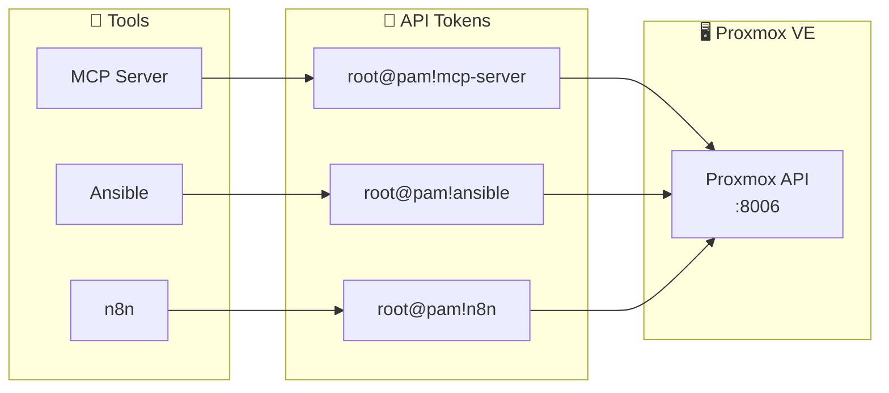

# How to Create a Proxmox API Token

## Overview

If you're automating anything against Proxmox — MCP servers, scripts, n8n workflows, Ansible playbooks — you need an API token. Not your root password. An API token.

Tokens are scoped, revocable, and auditable. This takes five minutes and you'll never paste your root password into a config file again.

!!! success "The Transformation"
    **BEFORE:** Root password hardcoded in scripts, config files, and automation tools. One leak and everything is exposed.

    **AFTER:** Named, revocable tokens scoped per tool. Compromise one, delete it, mint a new one. Everything else keeps working.

| Detail | Information |
|--------|-------------|
| **Difficulty** | Beginner |
| **Time Required** | 5 minutes |
| **Category** | Home Lab |
| **Last Updated** | May 2026 |

**Key Technologies:** Proxmox VE, API tokens, secrets management

---

## What You'll Learn

- Why API tokens matter more than convenience
- How to create and configure a Proxmox API token
- How to use it across different tools (HTTP headers, config files, env vars)
- How to revoke and rotate tokens safely

---

## Revoke and Rotate Tokens Safely

In Proxmox VE, go to **Datacenter -> Permissions -> API Tokens**, or open **Datacenter -> Permissions -> Users**, select the user, and view that user's tokens.

To **revoke** a token, find the token you want to retire, select it, and click **Remove**. That invalidates the token immediately, which is what you want if a secret leaked or a tool no longer needs access.

To **rotate** a token, use a simple remove-and-recreate flow:

1. Create a new token first if you need to avoid downtime.
2. Update your script, MCP server, n8n credential, or secret store to use the new token value.
3. Test the new token.
4. Remove the old token.

A practical naming pattern is `<tool>-<env>-<date>` such as `n8n-homelab-2026-05` or `ansible-prod-v2`. That makes it obvious what can be removed later and gives you a lightweight rotation history.

!!! tip "Rotation habit"
    Use one token per tool or workflow, not one shared token for everything. That way you can rotate or revoke one integration without breaking the rest of your automation.

Also remember: Proxmox only shows the token secret when you create it. Store it in your password manager or secret manager right away, because rotation means generating a new secret and updating every place that uses it.

---

## The Problem

At some point every homelab builder does this:

```yaml
proxmox_host: 192.168.x.x
proxmox_user: root@pam
proxmox_password: myactualpassword
```

It works. It's also a single point of catastrophic failure. That password unlocks everything. If it leaks — through a committed config file, a shared script, a logged environment variable — you're resetting everything on your Proxmox node.

The fix isn't complexity. It's tokens. A token is a credential scoped to exactly what it needs to do, named after the thing using it, and independently revocable without touching anything else.

---

## How AI Helped

<!-- This is a reference post, not an AI-driven project. The API token workflow itself predates AI tooling. -->

The workflow in this post was originally developed manually. AI assisted in writing and structuring the documentation, and in integrating token-based auth into tools like [ProxmoxMCP-Plus](proxmox-mcp-setup.md) — where the token is the credential that lets an AI assistant control your Proxmox environment safely.

---

## Architecture

How a token fits between your tools and Proxmox:



One token per tool. Each revocable independently. Your root password stays out of every config file.

---

## Prerequisites

- [ ] Proxmox VE instance running (any recent version)
- [ ] Admin access to the web UI
- [ ] Something that needs to talk to Proxmox (MCP server, script, etc.)

---

## Step 1: Log Into the Web UI

```
https://YOUR_PROXMOX_IP:8006
```

Log in as `root` or any user with administrator privileges.

!!! tip "Self-Signed Cert Warning"
    Most homelab Proxmox installs use a self-signed certificate. Your browser will warn you — click through or add a permanent exception. You can replace it with a Let's Encrypt cert later if you want.

---

## Step 2: Navigate to API Tokens

> **Datacenter** → **Permissions** → **API Tokens** → **Add**

<!-- TODO: Add screenshot: docs/assets/homelab/proxmox-api-token/api-tokens-nav.png -->

---

## Step 3: Fill In the Token Details

| Field | What to Put |
|---|---|
| **User** | `root@pam` (or your admin user) |
| **Token ID** | Something descriptive — `mcp-server`, `ansible`, `n8n` |
| **Privilege Separation** | Uncheck for full access |
| **Expire** | Leave blank for no expiry, or set a date for rotation discipline |

**Privilege Separation** is the key decision. Unchecked means the token inherits the full permissions of the user. Checked means you manage a separate, more restricted permission set. For homelab automation you trust, unchecked is fine. For anything external-facing, scope it down.

<!-- TODO: Add screenshot: docs/assets/homelab/proxmox-api-token/add-token-dialog.png -->

---

## Step 4: Copy the Secret — Right Now

After clicking **Add**, Proxmox shows you:

```
Token ID:  root@pam!your-token-name
Secret:    xxxxxxxx-xxxx-xxxx-xxxx-xxxxxxxxxxxx
```

!!! warning "One-Time Display"
    Proxmox will never show the secret again. Copy it immediately. If you lose it, delete the token and create a new one.

Put it somewhere safe:

- Password manager (Bitwarden, 1Password, etc.)
- Secrets manager
- Anywhere but a plaintext file in a git repo

---

## Step 5: Use It

**HTTP header:**
```
Authorization: PVEAPIToken=root@pam!your-token-name=xxxxxxxx-xxxx-xxxx-xxxx-xxxxxxxxxxxx
```

**Config file (split fields):**
```json
{
  "auth": {
    "user": "root@pam",
    "token_name": "your-token-name",
    "token_value": "xxxxxxxx-xxxx-xxxx-xxxx-xxxxxxxxxxxx"
  }
}
```

**Environment variables (cleanest for scripts):**
```bash
export PROXMOX_TOKEN_ID="root@pam!your-token-name"
export PROXMOX_TOKEN_SECRET="xxxxxxxx-xxxx-xxxx-xxxx-xxxxxxxxxxxx"
```

---

## Results

With tokens in place, your automation tools authenticate independently. Removing one token from Proxmox instantly revokes that tool's access without touching anything else.

A working token auth check against the Proxmox API:

```bash
curl -s -H "Authorization: PVEAPIToken=root@pam!your-token-name=xxxxxxxx-xxxx-xxxx-xxxx-xxxxxxxxxxxx" \
  https://YOUR_PROXMOX_IP:8006/api2/json/nodes \
  --insecure | python3 -m json.tool | head -10
```

Expected output: a JSON list of your Proxmox nodes. If you see `{"data":[]}` or a 401, the token is wrong or lacks permissions.

---

## Troubleshooting

**401 Unauthorized**  
Token ID format is wrong. It must be `USER@REALM!TOKEN_NAME` — the `!` separator is required.

**403 Permission Denied**  
Token was created with Privilege Separation enabled and lacks the needed permission. Either disable Privilege Separation or manually grant the required role in Proxmox.

**Token works but expires unexpectedly**  
Check the Expire field in Datacenter → Permissions → API Tokens. If set, the token stops working at that date silently.

---

## What's Next

Token-based auth is the foundation for every automation layer on top of Proxmox. Once it's in place:

- Wire it into an MCP server for natural language VM control — see [ProxmoxMCP-Plus Setup](proxmox-mcp-setup.md)
- Use it in Ansible playbooks for idempotent infrastructure management
- Feed it into n8n for scheduled maintenance workflows — see [Scheduled Proxmox Updates](../automation/n8n-scheduled-proxmox-updates.md)

!!! question "How many tokens do you have?"
    One per tool, or do you share credentials across your automation stack? Token sprawl is real — but so is the risk of a shared credential.

---

## Related

- [AI-Powered Proxmox MCP Infrastructure](mcp-proxmox-infrastructure.md)
- [ProxmoxMCP-Plus Setup Guide](proxmox-mcp-setup.md)
- [Scheduled Proxmox Updates with n8n](../automation/n8n-scheduled-proxmox-updates.md)
