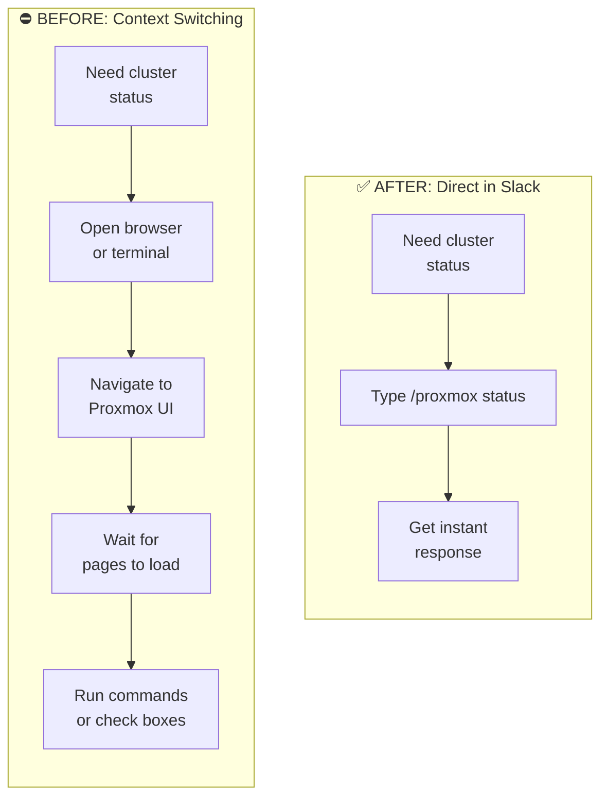
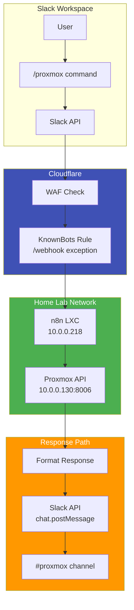
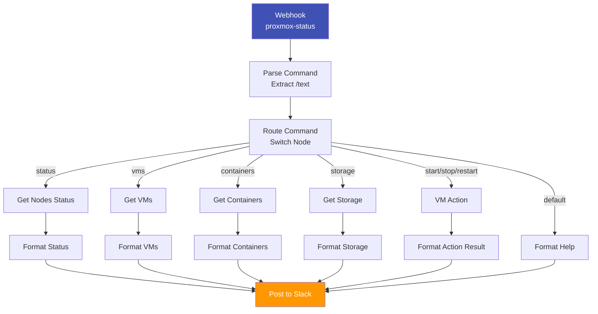

# Proxmox Slack Bot: Slash Commands for Real-Time Cluster Control

## Overview

I wanted a way to check my Proxmox cluster status without leaving Slack. Instead of context-switching to a terminal or browser, I could type `/proxmox status` and get instant cluster information right in my workspace.

I built a Slack bot powered by n8n that connects Slack's slash command interface directly to the Proxmox API. Now I can check VM status, view container lists, monitor storage, and control VMs—all from any Slack channel with natural commands.

The real breakthrough was discovering why the bot wasn't working: Cloudflare's WAF was blocking Slack's webhook requests. Once I understood the "known bots" classification, the solution was straightforward.

!!! success "The Transformation"
    **BEFORE:** Open browser → Proxmox UI → navigate menus → check status → *2+ minutes*

    **AFTER:** Type `/proxmox status` → instant response in Slack → *5 seconds*

---

## Project Details

| Detail | Information |
|--------|-------------|
| **Difficulty** | Intermediate |
| **Time Required** | 3-4 hours |
| **Category** | Home Lab + Automation |
| **Last Updated** | March 2026 |

**Key Technologies:** n8n, Proxmox VE API, Slack API, Cloudflare WAF, Docker, LXC

---

## What You'll Learn

- How n8n workflows process Slack slash commands
- Configuring Slack apps with OAuth scopes and slash commands
- Connecting Proxmox API authentication with n8n
- Debugging webhook connectivity through Cloudflare WAF
- Building async response patterns for Slack integrations

---

## The Problem: Context Switching Kills Flow

Here's my typical morning check: I want to see if all my VMs came up after a power outage. 

**The old way:**

1. Open browser to `https://10.0.0.130:8006`
2. Wait for Proxmox UI to load
3. Check cluster status across nodes
4. Open separate terminal for `pct list` and `qm list`
5. Check storage usage across pools

That's 5+ minutes of context switching before I even know my cluster is healthy.

What I wanted: `/proxmox status` → instant response in Slack, where I'm already working.



---

## How AI Helped

I used AI to accelerate the n8n workflow development. The heavy lifting was understanding the Slack API's async response requirements and debugging the Cloudflare WAF interaction.

Key contributions:
- Designing the workflow node structure for command routing
- Identifying the `responseMode: "onReceived"` requirement for Slack compatibility
- Debugging the WAF "known bots" rule blocking Slack's webhook requests

The AI didn't replace understanding the underlying APIs—it helped me work through the integration patterns faster.

---

## Architecture Overview



---

## Prerequisites

- Proxmox VE cluster with API access
- n8n instance (I run it in an LXC container)
- Cloudflare domain with WAF access
- Slack workspace with admin privileges

---

## Step-by-Step Setup

### 1. Create Proxmox API Token

1. Log into Proxmox Web UI
2. Navigate to **Datacenter → Permissions → API Tokens**
3. Click **Add**
4. Configure:
   - **Token ID:** `opencode`
   - **User:** `root@pam`
   - **Privileges:** PVEAuditor, PVEPVMAuthor, PVEStorageAdmin
5. Copy the token immediately (format: `root@pam!opencode=...`)

### 2. Create Slack App

1. Go to https://api.slack.com/apps
2. Click **Create New App → From scratch**
3. Name it "Proxmox Bot"

**OAuth Scopes:**
```
- chat:write
- chat:write.public
- commands
- channels:read
```

4. Click **Install to Workspace**
5. Copy the **Bot User OAuth Token** (starts with `xoxb-`)

### 3. Create Slash Command

1. In Slack App settings, click **Slash Commands**
2. Click **Create New Command**
3. Configure:
   - **Command:** `/proxmox`
   - **Request URL:** `https://YOUR_DOMAIN/webhook/proxmox-status`
   - **Short Description:** Control and monitor Proxmox cluster

### 4. Configure n8n Webhook

Create a new n8n workflow with:

1. **Webhook Node:**
   - Path: `proxmox-status`
   - HTTP Method: POST
   - **Response Mode: `onReceived`** ← Critical for Slack

2. **HTTP Request Node (Proxmox):**
   - Method: GET
   - URL: `https://10.0.0.130:8006/api2/json/nodes/pve/status`
   - Headers: `Authorization: PVEAPIToken=root@pam!opencode=YOUR_TOKEN`

3. **Slack Node:**
   - Operation: Post Message
   - Channel: Your channel ID
   - Bot Token: Your Slack bot token

### 5. Configure Cloudflare WAF Exception

**This is the step that fixed my bot.**

1. Go to Cloudflare Dashboard → Security → WAF → Custom rules
2. Find the **KnownBots** rule
3. Edit it to add exception:

```yaml
Expression: (cf.client.bot) and (http.request.uri.path ne "/webhook/proxmox-status")
```

This allows Slack's webhook requests through while blocking other bot traffic.

---

## Available Commands

| Command | Description |
|---------|-------------|
| `/proxmox status` | Full cluster status (VMs, containers, CPU, RAM) |
| `/proxmox vms` | List all virtual machines |
| `/proxmox containers` | List all containers |
| `/proxmox storage` | Storage usage across pools |
| `/proxmox start <id>` | Start a VM or container |
| `/proxmox stop <id>` | Stop a VM or container |
| `/proxmox restart <id>` | Restart a VM or container |
| `/proxmox help` | Show command reference |

---

## Troubleshooting: The Cloudflare WAF Issue

When I first set this up, the slash command showed "something went wrong" in Slack. The webhook worked via curl, but Slack's requests never reached n8n.

**The diagnostic process:**

1. **Tested webhook directly** - worked perfectly
2. **Checked n8n executions** - no new executions from Slack
3. **Reviewed Cloudflare Security Events** - found blocked requests from Slack IP 54.198.78.177

**Root cause:** Cloudflare's WAF classified Slack's webhook requests as "known bots" (they identify as `Slackbot 1.0`). The `KnownBots` rule was blocking them.

**Solution:** Add a path-based exception to allow Slack's requests through:

| Field | Operator | Value |
|-------|----------|-------|
| URI Path | does not equal | `/webhook/proxmox-status` |

This exception is added with AND logic, so requests to `/webhook/proxmox-status` bypass the block while all other bot traffic is still stopped.

---

## n8n Workflow Structure



---

## Results & Real-World Usage

Now I start every morning with:

```
/proxmox status
```

And get instant cluster health:

```
CLUSTER STATUS: pve

Node: pve
Status: Online
Uptime: 15 days, 7 hours

CPU: 8 cores @ 23% usage
Memory: 24.5 GB / 32 GB (76% used)

VMs Running: 5
Containers Running: 3

Overall Health: ✅ Healthy
```

When something needs attention:

```
/proxmox vms
```

Shows me exactly which VMs are running or stopped.

The best part: it's all in Slack, where I'm already working.

---

## Security Considerations

- Bot token stored securely in n8n credentials (encrypted)
- Proxmox API token uses least-privilege permissions
- Cloudflare WAF configured to allow only specific webhook paths
- All credentials excluded from version control

---

## What's Next

I'm exploring adding proactive alerting:

- Alert when CPU > 90% sustained
- Alert when storage > 85%
- Alert when VMs go down unexpectedly

The MCP infrastructure and this Slack bot are complementary—I use MCP for deep interactions and complex queries, while the Slack bot provides quick status checks throughout the day.

---

!!! question "Similar Integration?"
    Do you use any other Slack integrations for your home lab? I'm curious what other services people connect to their Proxmox clusters.
