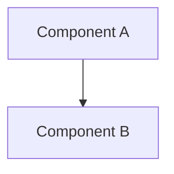

# Project Title

## Overview

2-3 sentences. What it does, why it matters. Scannable in 10 seconds.

!!! success "What You'll End Up With"
    One sentence: the concrete before/after transformation.

| Detail | Information |
|--------|-------------|
| **Difficulty** | Beginner |
| **Time Required** | X hours |
| **Category** | Home Lab |
| **Last Updated** | Month YYYY |

---

## What You'll Learn

- Outcome 1
- Outcome 2
- Outcome 3

---

## The Problem

The pain point before this existed. Make it relatable.

---

## How AI Helped

What AI contributed — discovery, architecture, debugging. Honest, specific.
Frame as capability multiplier, not replacement.

---

## Architecture



---

## Prerequisites

- [ ] Requirement 1
- [ ] Requirement 2

---

## Step 1: Title

Instructions.

```bash
example command
```

## Step 2: Title

Instructions.

---

## Results

Show actual output, screenshots, or conversation examples.

<!-- TODO: Add screenshot: docs/assets/homelab/post-slug/result.png -->

---

## Troubleshooting

**Problem:** What breaks  
**Fix:** How to solve it

---

## What's Next

What this foundation enables.

- Possibility 1
- Possibility 2

!!! question "What's your setup?"
    Engaging question for the reader.

---

## Related

- [Post Title](../section/post.md)
